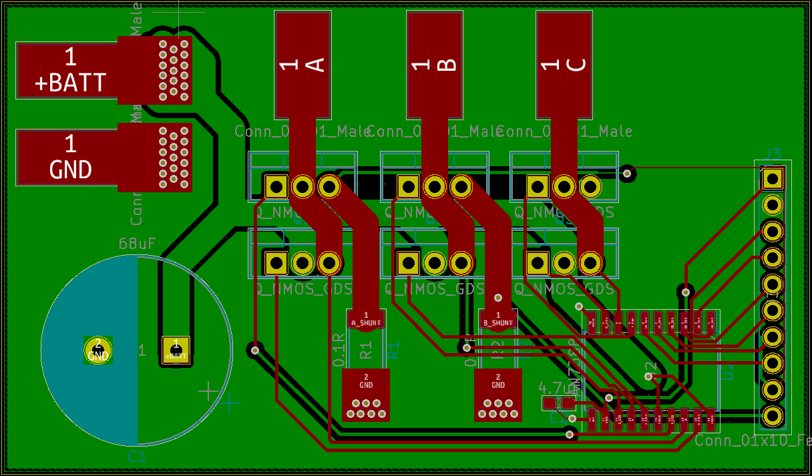
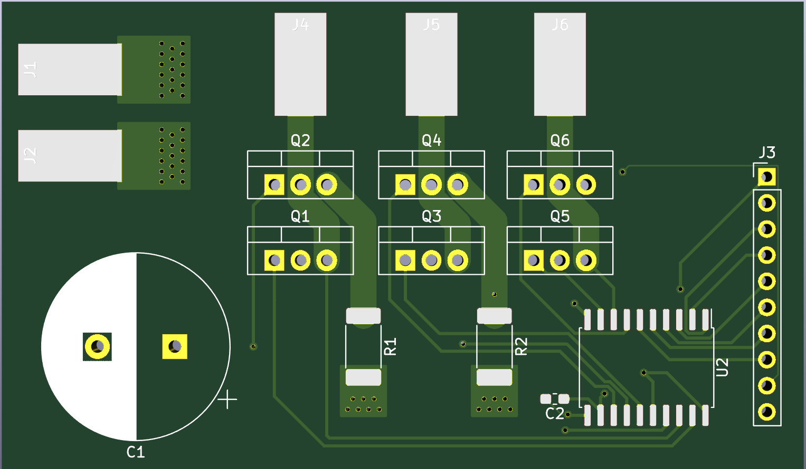

### BLDC/PMSM Dev Board

This board wad designed to prototype control algorithms for BLDC/PMSM type motors. It features the typical 3-phase half-bridge architecture with discrete N-Channel Mosfets, and shunt resistors on two of the phases. It operates at an Arduino/RPi friendly 3.3v logic and breaks all signals out to a 0.1 inch header

With an Arduino or other platform, a battery/power supply, and a motor, this design could be used to start protoyping traditional 6-step commutation, or something more advanced like Field Oriented Control

 
